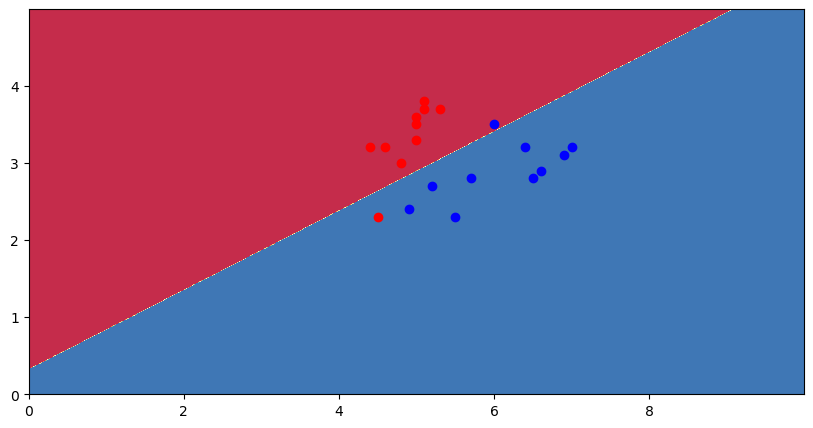
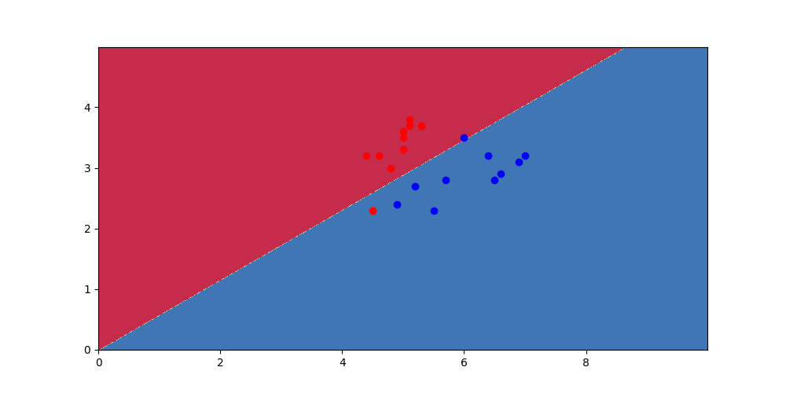
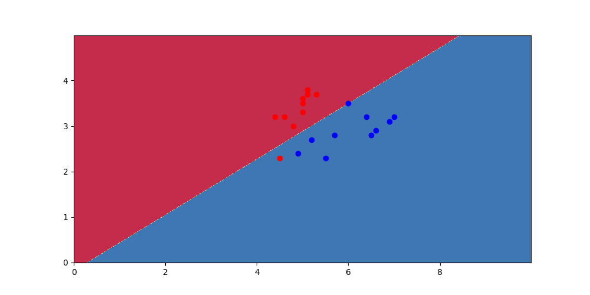

# 实验三：逻辑回归

## 第一部分：函数介绍

机器学习使用的数据集可能出现缺失值或异常值，或者是数据类型不适合直接应用于模型训练。因此，数据预处理是机器学习过程中十分重要的一个部分。

在第一部分学习到了如何使用python进行

- 判断一列是否有缺失值

- 对每一列的缺失值和异常值进行替换操作

- 将标记值从字符串编程容易操作的整数类型

- 可视化分类决策边界

- 画散点图

## 第二部分：逻辑回归

```python
# 导入机器学习常用的库
import pandas as pd
import numpy as np
import matplotlib.pyplot as plt
import math
import matplotlib as mpl
```

### 题目

<span style="color:purple">Iris数据集（鸢尾花卉数据集）是常用的分类实验数据集,是一类多重变量分析的数据集。我们实验选取数据集的部分内容，包含训练集80个数据样本和测试20个样本。每个数据有2个属性：花萼长度($x_1$)，花萼宽度($x_2$)。通过这2个属性预测鸢尾花卉属于（Setosa，Versicolour）二个种类中的哪一类。</span>

#### 1）

```python
#your code here------
# 将训练数据集'flower_train.csv'与测试数据集'flower_test.csv'载入到Dataframe对象中。
train_frame = pd.read_csv("flower_train.csv")
test_frame = pd.read_csv("flower_test.csv")

print(train_frame)
# 判断训练集中每列数据是否有缺失值或者不合理的数值
print(train_frame.isnull().sum())

# 先将0替换为空值
# 利用pandas中的replace函数将某一列的指定值替换为另一个值
train_frame[['x1', 'x2']] = train_frame[['x1', 'x2']].replace(0, np.NaN)

x1_column = train_frame['x1']
x2_column = train_frame['x2']

# 将空值替换为平均值
# 按种类分类并计算每组的平均花萼长度和花萼宽度
mean_x1_by_type = train_frame.groupby('type')['x1'].transform('mean')
mean_x2_by_type = train_frame.groupby('type')['x2'].transform('mean')
# 使用每个种类组的平均值来替换缺失值
train_frame['x1'].fillna(mean_x1_by_type, inplace=True)
train_frame['x2'].fillna(mean_x2_by_type, inplace=True)

# 查看是否还有缺失值或不合理的数值
print(train_frame)
print(train_frame.isnull().sum())

# 将标记值从字符串变成容易操作的整数类型
train_frame['type'] = np.where(train_frame['type'] == 'Iris-setosa', 0, 1)
test_frame['type'] = np.where(test_frame['type'] == 'Iris-setosa', 0, 1)
print(train_frame)
print(test_frame)
```

#### 2）

```python
# 相应地往测试集和训练集添加𝑥0=1这一特征
train_frame.insert(0, 'x0', 1)
test_frame.insert(0, 'x0', 1)
print(train_frame)
print(test_frame)
```

#### 3）

算法步骤如下：①初始化模型参数𝜔的值；②在负梯度的方向上更新参数(使用批量梯度下降)，并不断迭代这一步骤。

梯度的下降偏导公式为

$$
\frac{\partial J}{\partial \omega_j}=\frac{1}{m}\sum_{i=1}^m x_{ij}(\frac{e^{\omega^T x_i}}{1+e^{\omega^T x_i}}-y_i)
$$

参数更新的公式为

$$
\omega_j =\omega_j-\eta\frac{\partial J}{\partial w_j}
$$

其中$\eta$表示学习率，$m$则表示批量中的样本数量，$x_{ij}$代表着第i个样本的第j个特征值,$y_i$代表着第i个样本的真实值

```python
# 批量梯度下降
def batch_gradient_descent(omega_init, sample, learning_rate, threshold):
    def omega_update(omega):
        while True:
            omega_new = omega.copy()
            total_list = [0] * len(sample)
            for i in range(len(sample)):
                wx = omega[0] * sample[i][0] + omega[1] * sample[i][1] + omega[2] * sample[i][2]
                ewx = math.exp(wx)
                total_list[i] = (ewx / (1 + ewx) - sample[i][3])
            for i in range(3):
                s = 0
# 梯度的下降偏导公式
                for j, total in enumerate(total_list):
                    s += total * sample[j][i]
# 参数更新的公式                
                omega_new[i] = omega_new[i] - learning_rate * s / len(sample)
# 当omega_new和omega的变化程度小于threshold时结束迭代
            if all(abs(x - y) < threshold for x, y in zip(omega_new, omega)):
                break
            omega = omega_new
        return omega

    omega = omega_update(omega_init)
    return omega

# 初始化模型参数omega的值
omega_init = [1, 1, 1]
# 学习率
learning_rate = 0.01
# 阈值
threshold = 0.001

train = np.array(train_frame)
omega = batch_gradient_descent(omega_init, train, learning_rate, threshold)
print(omega)
```

输出结果

```powershell
[0.5845696021160349, 0.952909300237262, -1.8537717027300382]
```

#### 4)

损失函数

$$
J(\omega)=-\frac{1}{m}\sum^m_{i=1}{lnP(y_i|x_i,\omega)}=-\frac{1}{m}\sum^m_{i=1}ln(y_i\frac{1}{1+e^{-\omega^T x_i}}+(1-y_i)\frac{e^{-\omega^T x_i}}{1+e^{-\omega^T x_i}})
$$

```python
test = np.array(test_frame)
# 在模型训练完成后得到所训练的模型参数omega，在测试集上进行所训练模型的测试
trained = [omega[0] + omega[1] * x[1] + omega[2] * x[2] for x in test]

# 使用损失函数计算loss值
loss = 0
for i in range(len(test)):
    loss += math.log(test[i][3] / (1 + math.exp(-trained[i])) + (1 - test[i][3]) * math.exp(-trained[i]) / (1 + math.exp(-trained[i])))
loss = -loss / len(test)

print(loss)
```

输出结果

```powershell
0.3554652826957542
```

#### 5）

```python
#确定图画边界和大小
plt.figure(figsize=(10,5))
x_min, x_max = 0,10
y_min, y_max = 0,5
#使用numpy中的meshgrid生成网格矩阵，方便进行之后的描点
boundary_x, boundary_y = np.meshgrid(np.arange(x_min, x_max, 0.01),np.arange(y_min, y_max, 0.01))
grid = np.c_[boundary_x.ravel(), boundary_y.ravel()]
#加入偏置(或w_0)对应的特征为1的一列
e=np.ones((len(grid),1))
grid=np.c_[e,grid]
#假定下列的模型参数
w=np.array([[omega[0]],[omega[1]],[omega[2]]])
#计算出网格点中每个点对应的逻辑回归预测值
z=grid.dot(w)
for i in range(len(z)):
    z[i][0] = (1 / (1 + np.exp(-z[i][0])))
    if z[i][0]<0.5:
        z[i][0]=0
    else:
        z[i][0]=1
#转换shape将所得到的逻辑回归模型所得到的决策边界绘制出来
z=z.reshape(boundary_x.shape)
plt.contourf(boundary_x, boundary_y, z, cmap=plt.cm.Spectral, zorder=1)

# 测试集的所有点在同一幅图中进行绘制
class_1 = test_frame[test_frame['type'] == 1]
class_0 = test_frame[test_frame['type'] == 0]
# 给type == 1的测试点蓝色，给type == 0的测试点红色，通过颜色的区别直观看到预测正确和错误的样本
plt.scatter(class_1['x1'],class_1['x2'],c='blue')
plt.scatter(class_0['x1'],class_0['x2'],c='red')
plt.show()
```

输出结果



以上为学习率设置为0.001时得到的结果。

当学习率设置为0.0001时，omega为

```powershell
[-0.157995008570737, 4.092624517144397, -7.08149697462867]
```

loss值为

```powershell
0.1764902843715746
```

图像为



当学习率设置为0.0001时，omega为

```powershell
[-3.138366160328139, 10.31193177051994, -16.84028799629563]
```

loss值为

```powershell
0.26850222408959623
```

图像为



观察到，当threshold分别设置为0.001、0.0001、0.00001时，虽然loss值先变小再变大，但是图像中，决策边界的斜率越来越大。预测当threshold小到一定程度时，斜率达到一定值时，蓝色和红色预测错误的点最终会落到正确的区域。

## 第三部分：逻辑回归实验二

### 题目

<span style="color:purple">该数据集(train_titanic.csv和test_titanic.csv)同样为分类数据集，为泰坦尼克号的乘客信息以及最后是否生还。每个包括了七个特征值以及标记(代表是否生还),特征信息分别为Passengerid(乘客id)，Age(乘客年龄)，Fare(船票价格),Sex(性别)，sibsp(堂兄弟妹个数)，Parch(父母与小孩的个数)，Pclass(乘客等级)</span>

<span style="color:purple">该数据集已经做了处理，无缺失值和空值，且字符串类型全部转换成了整数类型，你们需要进行判断，在七个特征值至少选择四个你认为与最后是否生还关联度高的特征类别。该实验的任务依然是在训练集上使用逻辑回归方法和手动实现的梯度下降方法完成模型训练。</span>

在接下来实验中，我选择了四个特征值，分别是Age（乘客年龄），Sex（性别），Parch（父母与小孩的个数），Pclass（乘客）。

```python
# 导入机器学习常用的库
import pandas as pd
import numpy as np
import matplotlib.pyplot as plt
import mathath
```

#### 1）

```python
# 使用pandas库将训练集'train_titanic.csv'与测试数据集'test_titanic.csv'载入到Dataframe对象中
train_frame = pd.read_csv("train_titanic.csv")
test_frame = pd.read_csv("test_titanic.csv")
```

#### 2)

利用上个实验所使用的梯度下降方法（由于使用随机批量和小批量都发生了OverflowError，因此，改用批量梯度下降）

算法步骤如下：①初始化模型参数𝜔的值；②在负梯度的方向上更新参数(使用批量梯度下降)，并不断迭代这一步骤。

梯度的下降偏导公式为

$$
\frac{\partial J}{\partial \omega_j}=\frac{1}{m}\sum_{i=1}^m x_{ij}(\frac{e^{\omega^T x_i}}{1+e^{\omega^T x_i}}-y_i)
$$

参数更新的公式为

$$
\omega_j =\omega_j-\eta\frac{\partial J}{\partial w_j}
$$

其中$\eta$表示学习率，$m$则表示批量中的样本数量，$x_{ij}$代表着第i个样本的第j个特征值,$y_i$代表着第i个样本的真实值

```python
# 相应地往测试集和训练集添加𝑥0=1这一特征
train_frame.insert(0, "x0", 1)
test_frame.insert(0, "x0", 1)

# 批量梯度下降
def batch_gradient_descent(omega_init, sample, learning_rate, threshold):

    def omega_update(omega):
        while True:
            omega_new = omega.copy()
            # print(omega_new)
            total_list = [0] * len(sample)
            # print("hahaha")
            for i in range(len(sample)):
                wx = (
                    omega[0] * sample[i][0]
                    + omega[1] * sample[i][1]
                    + omega[2] * sample[i][2]
                    + omega[3] * sample[i][3]
                    + omega[4] * sample[i][4]
                )
                ewx = math.exp(wx)
                # print(ewx)
                total_list[i] = ewx / (1 + ewx) - sample[i][5]
            # print(total_list)
            for i in range(5):
                s = 0
# 梯度的下降偏导公式
                for j, total in enumerate(total_list):
                    s += total * sample[j][i]
# 参数更新的公式
                omega_new[i] = omega_new[i] - learning_rate * s / len(sample)
            if all(abs(x - y) < threshold for x, y in zip(omega_new, omega)):
                break
            omega = omega_new
        return omega

    omega = omega_update(omega_init)
    return omega

# 初始化模型参数omega的值
omega_init = [1, 1, 1, 1, 1]
# 学习率设置为0.01
learning_rate = 0.01
# 阈值设置为0.0001
threshold = 0.0001

train = np.array(train_frame)
omega = batch_gradient_descent(omega_init, train, learning_rate, threshold)
print(omega)
```

#### 3）

损失函数

$$
J(\omega)=-\frac{1}{m}\sum^m_{i=1}{lnP(y_i|x_i,\omega)}=-\frac{1}{m}\sum^m_{i=1}ln(y_i\frac{1}{1+e^{-\omega^T x_i}}+(1-y_i)\frac{e^{-\omega^T x_i}}{1+e^{-\omega^T x_i}})
$$

```python
# 使用训练后的逻辑回归模型对测试数据集'test_titanic.csv'进行预测
test = np.array(test_frame)
trained = [
    omega[0] + omega[1] * x[1] + omega[2] * x[2] + omega[3] * x[3] + omega[4] * x[4]
    for x in test
]

# 使用损失函数计算loss值
loss = 0
for i in range(len(test)):
    loss += math.log(
        test[i][5] / (1 + math.exp(-trained[i]))
        + (1 - test[i][5]) * math.exp(-trained[i]) / (1 + math.exp(-trained[i]))
    )
loss = -loss / len(test)

print(loss)
```

取omega初始值为[3, 3, 3, 3, 3]，

threshold设置为0.001时，omega为

```powershell
[1.85292828630153, -0.07677922855154168, 2.4721323256405565, 0.6185499708649277, -1.0675631218691828]
```

loss值为

```powershell
0.6326159795753409
```

threshold设置为0.0001时，omega为

```powershell
[1.5982342948500974, -0.05515691872753953, 2.115991350403841, -0.09446342211739814, -1.0193405769141177]
```

loss值为

```powershell
0.5556161200534883
```

threshold设置为0.00001时，omega为

```powershell
[0.2621491230570663, -0.03352492331503038, 1.8806578863681949, -0.07688465154355978, -0.6397312133294268]
```

loss值为

```powershell
0.5687583422417055
```

观察到，omega_0的变化最大（为什么？），而且当threshold设置为0.0001时，loss值最小。

接下来固定threshold=0.0001，由于omega变化较大，不再列出。

取omega初始值为[0, 0, 0, 0, 0]，loss值为

```powershell
0.5741462054082823
```

取omega初始值为[1, 1, 1, 1, 1]，loss值为

```powershell
0.565940111995483
```

取omega初始值为[2, 2, 2, 2, 2]，loss值为

```powershell
0.5568659743713252
```

取omega初始值为[4, 4, 4, 4, 4]，loss值为

```powershell
0.5536965876501643
```

loss值逐渐减小并趋于稳定。

## 感想

第三部分逻辑回归实验中，Age这个特征值的数特别大， 梯度下降时，使用随机批量和小批量都发生了OverflowError，因此只能改用批量梯度下降。

感觉自己在代码实现的思路上，还停留在其它语言的思路，没有利用到python本身的特性，以及numpy库造好的轮子。

不太清楚如何评定实验结果好坏，也不太明白如何针对实验结果，调整参数。只能尽量调整，从而使得loss值最小。
