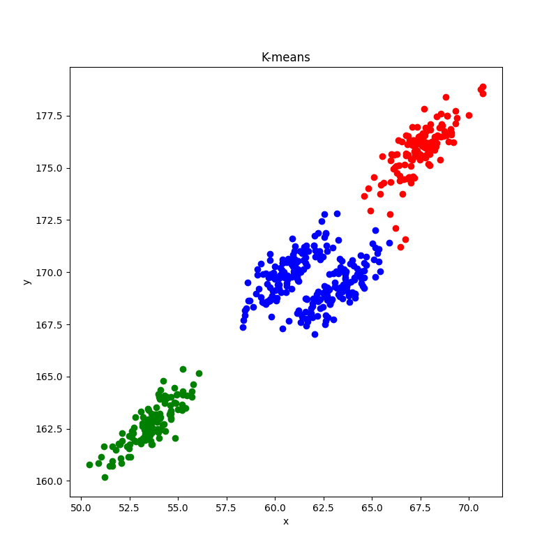
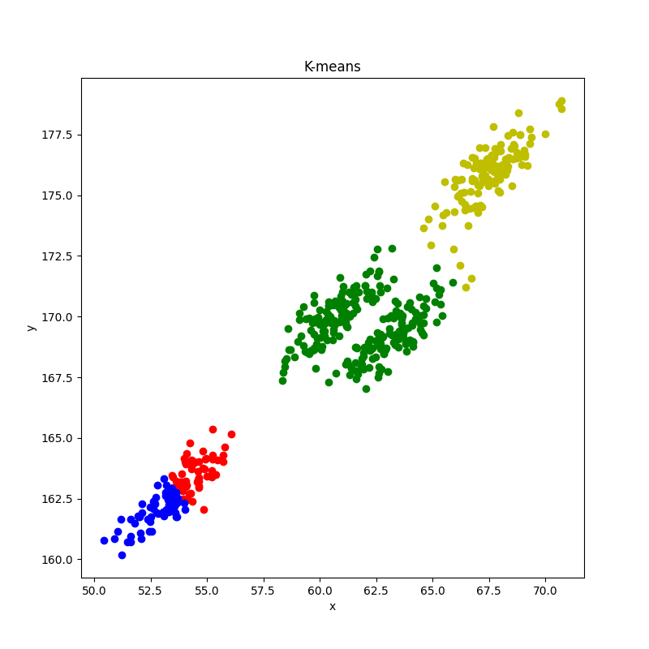
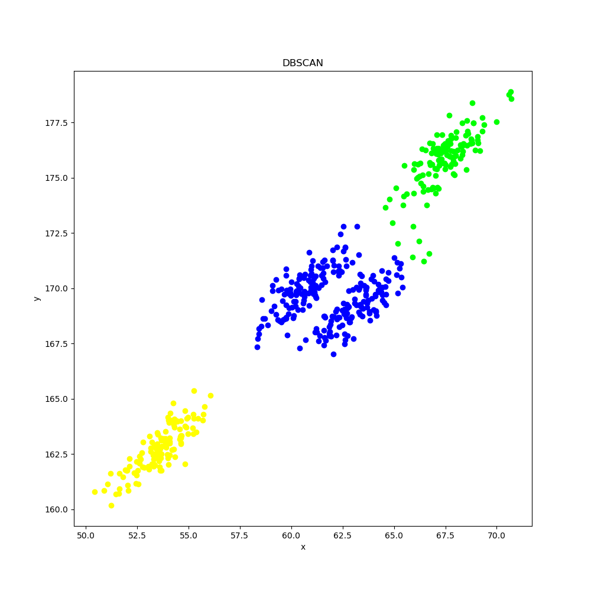
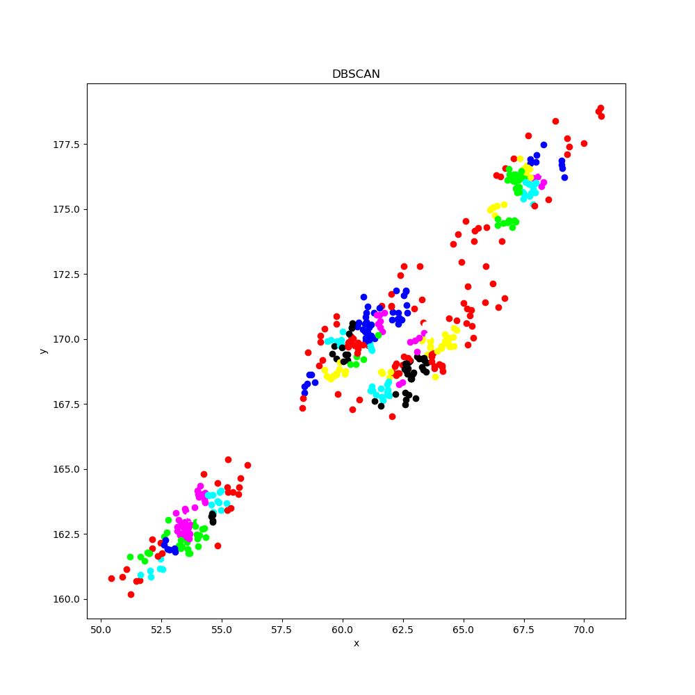

# 实验七：聚类

两种距离计算公式的实现

```py
#曼哈顿距离
def manhattan_distance(x, y):
    return abs(x - y).sum()

#欧式距离
def euclidean_distance(x,y):
    return math.sqrt(((x - y)**2).sum())
```

本次实验使用欧式距离

## 算法一：原型聚类法

### 代码

仅给出核心代码

```py
#欧式距离
def euclidean_distance(x,y):
    return math.sqrt(((x - y)**2).sum())

#加载数据集
df = pd.read_csv('train.csv')
D = np.array(df)

#聚类数量
k = 3

#初始化每个聚类的簇心向量
u = [None for i in range(k)]
u_prime = [None for i in range(k)]

#随机选取k个样本作为初始均值向量
for i in range(k):
    #随机选取一个样本的索引
    index = random.randint(0, len(D) - 1)
    #将该样本作为初始均值向量
    u_prime[i] = D[index]

#比较均值向量是否相同
def equallist(x,y):
    for i in range(len(x)):
        if not (x[i] == y[i]).all():
            return False
    return True

C = [[] for i in range(k)]

#迭代过程
while(not equallist(u, u_prime)):
    #初始化
    u = u_prime.copy()
    C = [[] for i in range(k)]

    #计算每个样本与k个聚类的簇心的距离，将其划入距离最近的簇
    for i in range(len(D)):
        d = [0 for _ in range(k)]
        for j in range(k):
            d[j] = euclidean_distance(D[i], u[j])
        C[d.index(min(d))].append(D[i])

    #更新这轮迭代的簇心
    for i in range(k):
        u_prime[i] = np.mean(C[i], axis=0)

# 判断是否有空簇,返回所有非空的簇,空簇丢弃
def check_null(C):
    C_new = []
    for i in range(len(C)):
        if len(C[i]) == 0:
            continue
        else:
            C_new.append(C[i])
    return C_new

C = check_null(C)
```

### 结果

k = 3时



尝试将聚类数量k修改为4，意图将蓝色簇以45°分为两簇。结果发现，k = 4时



不但没有将原有蓝色簇（此时为绿色）一分为二，反而将原有绿色簇（此时为红蓝）一分为二。聚类效果反而不如k = 3。

## 算法二：密度聚类法

### 代码

仅给出核心代码

```py
# 欧式距离
def euclidean_distance(x, y):
    return math.sqrt(((x - y) ** 2).sum())


def get_neighbors(D, index, epsilon):
    neighbors = []
    # 遍历所有样本
    for i in range(len(D)):
        if i == index:
            continue
        # 如果样本与当前样本的距离小于等于邻域半径，则将其加入邻域内
        if euclidean_distance(D[i], D[index]) <= epsilon:
            neighbors.append(i)

    return neighbors


def core_set(D, epsilon, MinPts):
    # 初始化核心对象集合
    core = set()

    # 对每个样本进行遍历
    for i in range(len(D)):
        # 获取邻域内的所有样本的索引
        neighbors = get_neighbors(D, i, epsilon)

        # 如果邻域内的样本数量大于等于最小样本数，则将当前样本标记为核心对象
        if len(neighbors) >= MinPts:
            core.add(i)

    return list(core)


df = pd.read_csv("train.csv")

# 初始化参数epsilon,MinPts
D = np.array(df)
epsilon = 5
MinPts = 8

# 初始化标签数组，0表示未分类
labels = [0 for i in range(len(D))]

# 生成核心对象集合
core = core_set(D, epsilon, MinPts)

# 定义当前簇的标签
cluster_id = 1

# 对核心对象集合进行遍历
for i in range(len(core)):
    # 如果核心对象已经分类，则跳过
    if labels[core[i]] != 0:
        continue

    # 创建一个新的簇，将核心对象标记为该簇
    labels[core[i]] = cluster_id

    # 获取由核心对象密度直达的样本集合Δ
    s = get_neighbors(D, core[i], epsilon)

    # 遍历样本集合Δ
    while s:
        # 取出一个样本
        t = s.pop()

        # 如果样本已经分类，则跳过
        if labels[t] != 0:
            continue

        # 将样本标记为当前簇
        labels[t] = cluster_id

        # 获取由样本密度直达的样本集合Δ'
        s_prime = get_neighbors(D, t, epsilon)

        # 如果样本是核心对象，则将Δ'中的样本加入Δ
        if t in core:
            for i in range(len(s_prime)):
                if labels[s_prime[i]] != 0:
                    s.append(s_prime[i])
    cluster_id += 1

```

### 结果

经过多次调试，当epsilon = 5，MinPts = 8时，聚类效果与K-means算法k = 3时的效果相似。



## 总结

在做聚类实验的时候，我认为，相比于无头苍蝇一般胡乱修改参数，预先将数据的图画出来，根据数据点的取值范围、分布情况来调试参数更加方便快捷。

比如说，在编写DBSCAN算法的时候，GitHub Copilot给出的参数提示为epsilon = 0.5，MinPts = 5，画出来的图如下



聚类效果很差。主要是数据的取值范围与提示的epsilon相差太大，每个数据点的邻域很小，导致可密度直达的点就更少，最终分类出很多簇。