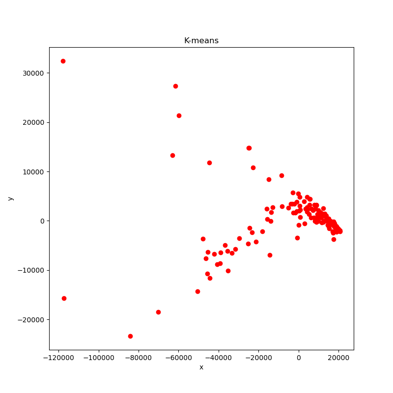
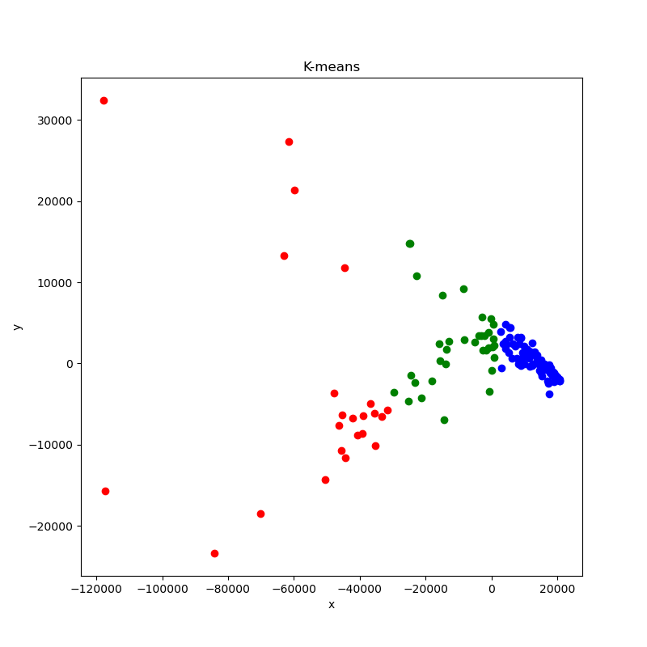
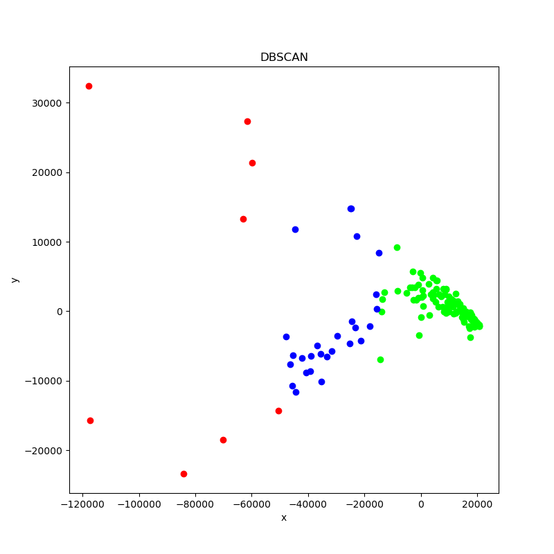
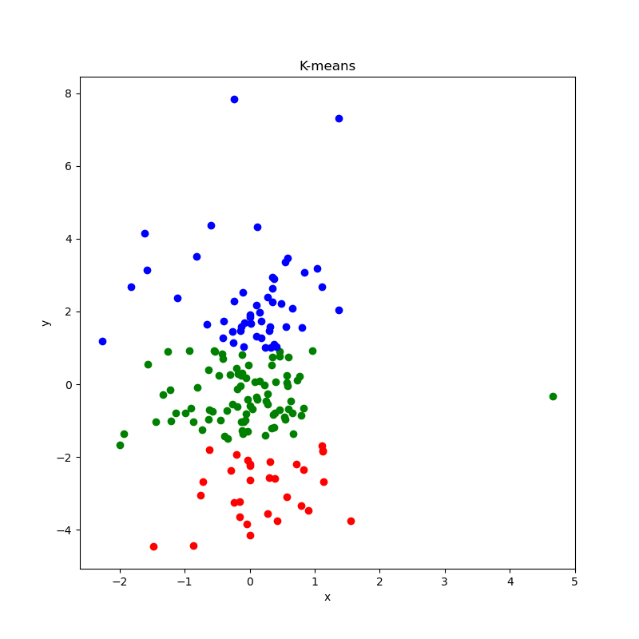

# 实验八：降维

## 代码

```python
import pandas as pd
import numpy as np
import matplotlib.pyplot as plt
import math
import matplotlib as mpl
import warnings
# 将实验七的两种聚类算法模块化，用于最后一步的聚类
from K_means import K_means
from DBSCAN import DBSCAN

warnings.filterwarnings("ignore")
from pandas.core.frame import DataFrame

df = pd.read_csv("train_data.csv")

# 转置，将原始数据按列组成9行167列的矩阵
X = np.array(df.iloc[:, :].T)

# 中心化
for i in range(X.shape[0]):
    X[i, :] = X[i, :] - np.mean(X[i, :])

# 协方差矩阵
C = np.dot(X, X.T) / (X.shape[1] - 1)

# 特征值分解
lambdas, omegas = np.linalg.eig(C)

# 这里取阈值为t% = 0.99
t = 0.99

# 根据特征值降序排序，计算降维后的维度k
lambdas_omegas = [(lambdas[i], omegas[:, i]) for i in range(len(lambdas))]
lambdas_omegas = sorted(lambdas_omegas, reverse=True)

k = len(lambdas_omegas)
for i in range(k + 1):
    if (
        sum([lambdas_omegas[j][0] for j in range(i)])
        / sum([lambdas_omegas[j][0] for j in range(k)])
        >= t
    ):
        k = i
        break

# 取前k个特征值对应的特征向量组成矩阵W
W = np.array([lambdas_omegas[i][1] for i in range(k)]).T

# 计算降到k维后的数据
Y = np.dot(W.T, X)

# K-means聚类
# 参数：降维后的数据，聚类簇数
K_means(Y.T, 5)

# DBSCAN聚类
# 参数：降维后的数据，半径，最小样本数
DBSCAN(Y.T, 35000, 40)
```

## 结果

### 聚类前

降维结果，未进行聚类（这里偷懒用K-means算法，将参数k设置为1）

结果与调用sklearn.decompostion的PCA得到的结果，关于y轴对称，尚未找到原因。



### 聚类后

#### K-means算法

k = 3



#### DBSCAN算法

epsilon = 35000，Minpts = 40



## 总结

在做聚类的时候预先将数据的图画出来，根据数据点的取值范围、分布情况来调试参数更加方便快捷。与实验七聚类实验相同。

发现没有什么好总结的，于是试着选取特征值最小的两个特征向量组成矩阵，重新降维画图。

结果如下



乍一看，好像降维效果比原有的更好？仔细一看，样本分布的数据范围为-3 < x < 5，-6 < y < 8，与原本的数据分布-120000 < x < 40000，-20000 < y < 30000相比，这些样本就是堆积在一起的一坨。

验证了依据特征值选取特征向量的效果，特征值越大越好。

