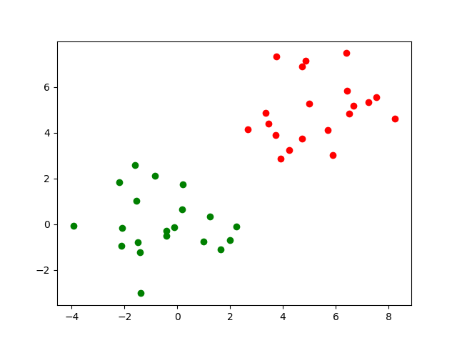

# 实验十一：支持向量机

## 线性可分支持向量机与硬间隔最大化

### 代码

```python
import numpy as np
import pandas as pd
import matplotlib.pyplot as plt
import math
import cvxopt
from cvxopt import matrix
from cvxopt import solvers

# 读入数据集并转换成np.double类型，画出数据集的散点图
dataset1 = pd.read_csv("dataset1.csv")
dataset1 = np.array(dataset1, dtype=np.double)
plot_x1 = dataset1[:, 0]
plot_x2 = dataset1[:, 1]
plot_y = dataset1[:, 2]
for i in range(len(plot_y)):
    if plot_y[i] == 1:
        plt.scatter(plot_x1[i], plot_x2[i], c="r", marker="o")
    else:
        plt.scatter(plot_x1[i], plot_x2[i], c="g", marker="o")
plt.show()

# 求出二次规划问题中的P，q，G，h，A，b矩阵
X = dataset1[:, 0:2]
Y = dataset1[:, 2]
X_prime = X * Y.reshape(-1, 1)
P = matrix(np.dot(X_prime, X_prime.T))
q = matrix(-1 * np.ones(len(X)))
G = matrix(-1 * np.eye(len(X)))
h = matrix(np.zeros(len(X)))
A = matrix(Y.reshape(1, -1))
b = matrix(0.0)
sol = solvers.qp(P, q, G, h, A, b)
lamda_star = np.array(sol["x"])

# 求出omega_star和b_star，设置阈值threshold=1e-5，筛去非常靠近0的分量
threshold = 1e-5
omega_star = sum(lamda_star[i] * Y[i] * X[i] for i in range(len(X)))
b_star = [
    Y[i] - np.dot(omega_star.T, X[i])
    for i in range(len(X))
    if lamda_star[i] > threshold
]

# 画出数据集的散点图与间隔边界
for i in range(len(plot_y)):
    if lamda_star[i] > threshold:
        plt.scatter(plot_x1[i], plot_x2[i], c="b", marker="o")
    elif plot_y[i] == 1:
        plt.scatter(plot_x1[i], plot_x2[i], c="r", marker="o")
    else:
        plt.scatter(plot_x1[i], plot_x2[i], c="g", marker="o")
x1 = np.arange(-4, 10, 0.01)
x2 = np.arange(-4, 8, 0.01)
x1, x2 = np.meshgrid(x1, x2)
y0 = omega_star[0] * x1 + omega_star[1] * x2 + b_star[0]
y1 = omega_star[0] * x1 + omega_star[1] * x2 + b_star[1]
y2 = omega_star[0] * x1 + omega_star[1] * x2 + b_star[2]
plt.contour(x1, x2, y0, [0], colors="red")
plt.contour(x1, x2, y1, [1], colors="black", linestyles="dashed")
plt.contour(x1, x2, y2, [-1], colors="black", linestyles="dashed")
plt.show()

```

### 结果



观察样本的分布，必定存在某个超平面 $\mathbf{\omega}^T\mathbf{x}+b=0$ ，能够将数据集的正实例点和负实例点完全正确地划分到超平面的两侧。


求解出的超平面完美地将数据集的正实例点和负实例点完全正确地划分两侧。

## 线性支持向量机与软间隔最大化

### 代码

### 结果

## 非线性支持向量机与核函数

### 代码

### 结果

