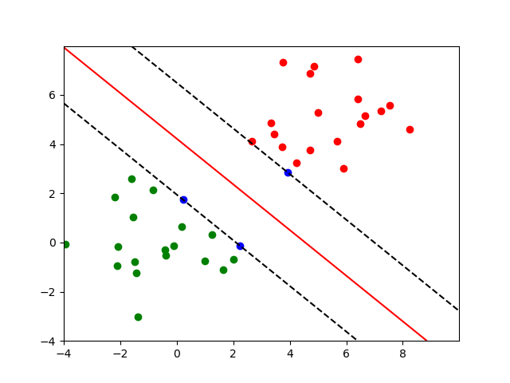

# 实验十一：支持向量机

## 线性可分支持向量机与硬间隔最大化

### 代码

```python
import numpy as np
import pandas as pd
import matplotlib.pyplot as plt
import math
import cvxopt
from cvxopt import matrix
from cvxopt import solvers

# 读入数据集并转换成np.double类型，画出数据集的散点图
dataset1 = pd.read_csv("dataset1.csv")
dataset1 = np.array(dataset1, dtype=np.double)
plot_x1 = dataset1[:, 0]
plot_x2 = dataset1[:, 1]
plot_y = dataset1[:, 2]
for i in range(len(plot_y)):
    if plot_y[i] == 1:
        plt.scatter(plot_x1[i], plot_x2[i], c="r", marker="o")
    else:
        plt.scatter(plot_x1[i], plot_x2[i], c="g", marker="o")
plt.show()

# 求出二次规划问题中的P，q，G，h，A，b矩阵
X = dataset1[:, 0:2]
Y = dataset1[:, 2]
X_prime = X * Y.reshape(-1, 1)
P = matrix(np.dot(X_prime, X_prime.T))
q = matrix(-1 * np.ones(len(X)))
G = matrix(-1 * np.eye(len(X)))
h = matrix(np.zeros(len(X)))
A = matrix(Y.reshape(1, -1))
b = matrix(0.0)
sol = solvers.qp(P, q, G, h, A, b)
lamda_star = np.array(sol["x"])

# 求出omega_star和b_star，设置阈值threshold=1e-5，筛去非常靠近0的分量
threshold = 1e-5
omega_star = sum(lamda_star[i] * Y[i] * X[i] for i in range(len(X)))
b_star = [
    Y[i] - np.dot(omega_star.T, X[i])
    for i in range(len(X))
    if lamda_star[i] > threshold
]

# 画出数据集的散点图、决策边界和间隔边界
for i in range(len(plot_y)):
    if lamda_star[i] > threshold:
        plt.scatter(plot_x1[i], plot_x2[i], c="b", marker="o")
    elif plot_y[i] == 1:
        plt.scatter(plot_x1[i], plot_x2[i], c="r", marker="o")
    else:
        plt.scatter(plot_x1[i], plot_x2[i], c="g", marker="o")
x1 = np.arange(-4, 10, 0.01)
x2 = np.arange(-4, 8, 0.01)
x1, x2 = np.meshgrid(x1, x2)
y0 = omega_star[0] * x1 + omega_star[1] * x2 + b_star[0]
y1 = omega_star[0] * x1 + omega_star[1] * x2 + b_star[1]
y2 = omega_star[0] * x1 + omega_star[1] * x2 + b_star[2]
plt.contour(x1, x2, y0, [0], colors="red")
plt.contour(x1, x2, y1, [1], colors="black", linestyles="dashed")
plt.contour(x1, x2, y2, [-1], colors="black", linestyles="dashed")
plt.show()

```

### 结果


观察样本的分布，必定存在某个超平面 $\mathbf{\omega}^T\mathbf{x}+b=0$ ，能够将数据集的正实例点和负实例点完全正确地划分到超平面的两侧。



求解出的超平面完美地将数据集的正实例点和负实例点完全正确地划分两侧。

## 线性支持向量机与软间隔最大化

### 代码

代码构成与线性可分大致相同，这里只给出不同部分的代码。

```python
...

# 读入数据集并转换成np.double类型，画出数据集的散点图
...

# 求出二次规划问题中的P，q，G，h，A，b矩阵，并设置参数c=1
X = dataset2[:, 0:2]
...
G = matrix(np.zeros((2 * len(X), len(X))))
for i in range(len(X)):
    G[i, i] = -1
for i in range(len(X)):
    G[i + len(X), i] = 1
h = matrix(np.zeros(2 * len(X)))
C = 1
for i in range(len(X)):
    h[i + len(X)] = C
...

# 求出omega_star和b_star，设置阈值threshold=1e-5，筛去非常靠近0和C的分量
threshold = 1e-5
omega_star = sum(lamda_star[i] * Y[i] * X[i] for i in range(len(X)))
b_star = [
    Y[i] - np.dot(omega_star.T, X[i])
    for i in range(len(X))
    if threshold < lamda_star[i] < C - threshold
]

# 画出数据集的散点图、决策边界和间隔边界
...

```

### 结果


观察样本的分布，训练样本难以完全线性可分。


上图为C = 1，threshold = 1e-5时的结果，C在[1, 2)区间的结果完全相同，C = 2时就无法求出更多的b*了。

引入了松弛变量，允许一些样本不满足条件，因此可以看到一些支持向量在两个间隔边界之间。红色样本误分的数量为2，绿色样本误分的数量为1。

## 非线性支持向量机与核函数

### 代码

.ipynb中说优化问题与硬间隔相似，仅矩阵P有改动。但我使用硬间隔的其他矩阵，无法求解出结果。改用软间隔后，成功求解出结果。非线性支持向量机与核函数中的优化问题应该与软间隔相似。

```python
import numpy as np
import pandas as pd
import matplotlib.pyplot as plt
import math
import cvxopt
from cvxopt import matrix
from cvxopt import solvers

# 读入数据集并转换成np.double类型，画出数据集的散点图
Raisin_train = pd.read_csv("Raisin_train.csv")
Raisin_train = np.array(Raisin_train, dtype=np.double)

X = Raisin_train[:, 0:7]
Y = Raisin_train[:, 7]


# 求出二次规划问题中的P，q，G，h，A，b矩阵，并设置参数c=1
def K(x, z):
    return np.dot(x.T, z)


P = matrix(0.0, (len(X), len(X)))
for i in range(len(X)):
    for j in range(len(X)):
        P[i, j] = Y[i] * Y[j] * K(X[i], X[j])

# 软间隔
q = matrix(-1 * np.ones(len(X)))
G = matrix(np.zeros((2 * len(X), len(X))))
for i in range(len(X)):
    G[i, i] = -1
for i in range(len(X)):
    G[i + len(X), i] = 1
h = matrix(np.zeros(2 * len(X)))
C = 1
for i in range(len(X)):
    h[i + len(X)] = C
A = matrix(Y.reshape(1, -1))
b = matrix(0.0)
sol = solvers.qp(P, q, G, h, A, b)
lamda_star = np.array(sol["x"])

# 求出b_star，设置阈值threshold=1e-5，筛去非常靠近0的分量
threshold = 1e-5
b_star = [
    Y[j] - sum(lamda_star[i] * Y[i] * K(X[i], X[j]) for i in range(len(X)))
    for j in range(len(X))
    if threshold < lamda_star[j] < C - threshold
]

# 读入测试集，用分类决策函数进行预测，输出预测准确率
Raision_test = pd.read_csv("Raisin_test.csv")
Raision_test = np.array(Raision_test, dtype=np.double)


def f(x):
    return np.sign(
        sum(lamda_star[i] * Y[i] * K(X[i], x) for i in range(len(X))) + b_star[0]
    )


acc = 0
for i in range(len(Raision_test)):
    if f(Raision_test[i, 0:7]) == Raision_test[i, 7]:
        acc += 1
print("预测准确率：", acc / len(Raision_test))

```

### 结果

```
     pcost       dcost       gap    pres   dres
 0: -3.8632e+02 -2.6518e+03  2e+04  4e+00  2e-14
 1: -2.4156e+02 -2.0424e+03  4e+03  6e-01  2e-14
 2: -1.9258e+02 -6.9369e+02  5e+02  2e-02  3e-14
 3: -2.4651e+02 -3.4620e+02  1e+02  3e-03  2e-14
 4: -2.7551e+02 -3.1075e+02  4e+01  9e-04  2e-14
 5: -2.8436e+02 -3.0005e+02  2e+01  3e-04  2e-14
 6: -2.8788e+02 -2.9562e+02  8e+00  1e-04  1e-14
 7: -2.9017e+02 -2.9282e+02  3e+00  4e-05  2e-14
 8: -2.9101e+02 -2.9182e+02  8e-01  1e-05  2e-14
 9: -2.9134e+02 -2.9144e+02  1e-01  7e-07  2e-14
10: -2.9139e+02 -2.9139e+02  4e-03  2e-08  2e-14
11: -2.9139e+02 -2.9139e+02  6e-05  3e-10  2e-14
Optimal solution found.
C： 1
预测准确率： 0.85
```

C = 1时，预测准确率达到了85%，且已经是峰值，无法再提升了。

## 总结

关于间隔最大化，概念还是容易理解的，但是求解二次规划问题的各种矩阵，太久没接触数学，一时也搞不清楚。希望复习的时候能搞懂吧。

mark一个复习视频。

[[5分钟学算法] #05 支持向量机 软硬通吃分类大法](https://www.bilibili.com/video/BV1vv4y1g721/?spm_id_from=333.337.search-card.all.click&vd_source=212ff176b778171e26249f81cfb5bdbc)