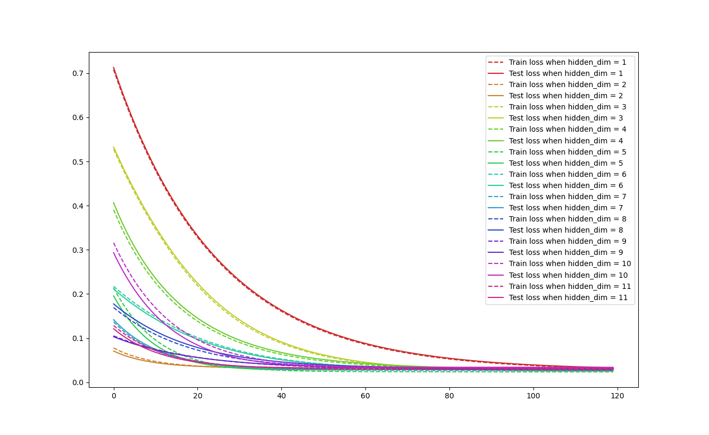
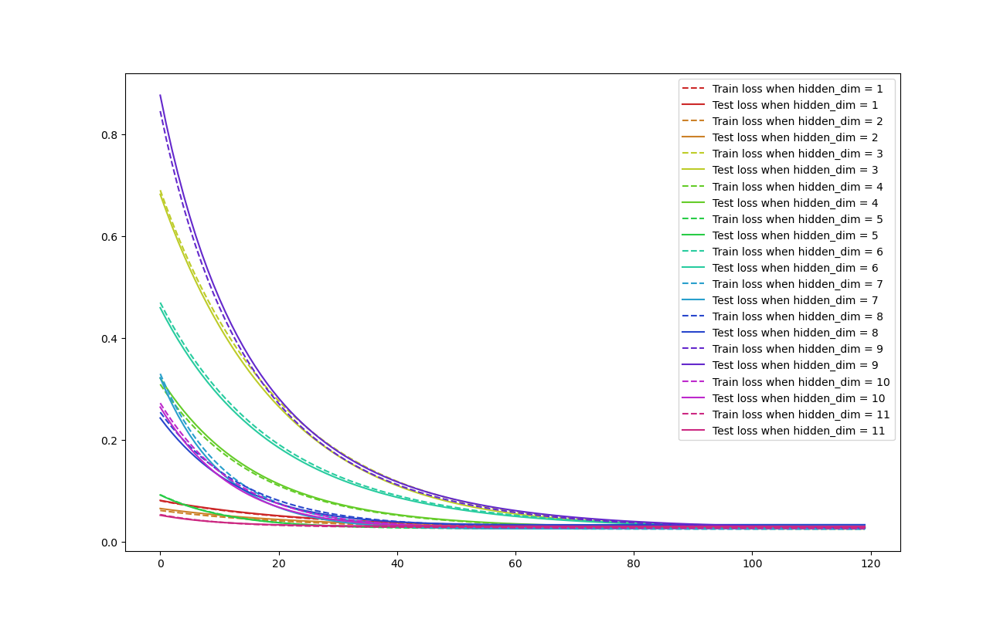

# 实验十二：神经网络

## 代码

为了避免一次又一次地修改隐藏层大小`hidden_dim`这一参数，将其初始化为输入维度，迭代完成后，自减1，继续迭代。直到`hidden_dim == 0`为止。也能更直观地看到隐藏层大小不同时，训练损失和测试损失的变化情况。

```python
import numpy as np
import pandas as pd
import matplotlib.pyplot as plt
import torch
import torch.nn as nn
import torch.nn.functional as F
import torch.optim as optim
from torch.autograd import Function
import os
import colorsys

#  读入训练数据集'wine_train.csv'与测试数据集'wine_test.csv'
wine_train = pd.read_csv("wine_train.csv")
wine_test = pd.read_csv("wine_test.csv")

# 利用线性层和激活函数搭建一个神经网络，输入和输出维度与数据集维度一致，而神经网络深度、隐藏层大小、激活函数种类等超参数自行调整
# 输入维度为11
input_dim = wine_train.shape[1] - 1
hidden_dim = 11
output_dim = 1
num_colors = hidden_dim


# 定义神经网络模型，继承自nn.Module
class Net(nn.Module):
    # 输入层的维度为 input_dim
    # 隐藏层的维度为 hidden_dim
    # 输出层的维度为 output_dim
    def __init__(self, input_dim, hidden_dim, output_dim):
        super(Net, self).__init__()
        self.fc1 = nn.Linear(input_dim, hidden_dim)
        self.fc2 = nn.Linear(hidden_dim, output_dim)
        # 激活函数relu，用于在全连接层之间加入非线性变换
        self.relu = nn.ReLU()

    def forward(self, x):
        out = self.fc1(x)
        out1 = self.relu(out)
        out2 = self.fc2(out1)
        return out1, out2


# 记录训练损失和测试损失
dot = [[] for _ in range(hidden_dim)]

# 训练周期
Epoch = 120

while hidden_dim > 0:
    # 创建神经网络模型实例
    net = Net(input_dim, hidden_dim, output_dim)
    # print(net)

    # 定义损失函数和优化器
    criterion = nn.MSELoss()
    optimizer = optim.SGD(net.parameters(), lr=0.01)

    for epoch in range(Epoch):
        # print("Epoch:", epoch)
        # 读取训练数据集的特征和标签
        train_features = torch.tensor(wine_train.iloc[:, 0:11].values)
        train_labels = torch.tensor(wine_train.iloc[:, 11].values).view(-1, 1)
        train_features = train_features.float()
        train_labels = train_labels.float()

        # 读取测试数据集的特征和标签
        test_features = torch.tensor(wine_test.iloc[:, 0:11].values)
        test_labels = torch.tensor(wine_test.iloc[:, 11].values).view(-1, 1)
        test_features = test_features.float()
        test_labels = test_labels.float()

        # 前向传播
        output1, output2 = net(train_features)

        # 计算损失
        loss = criterion(output2, train_labels)

        # 梯度清零
        optimizer.zero_grad()

        # 反向传播
        loss.backward()

        # 更新参数
        optimizer.step()

        # 计算测试集上的准确率
        test_output1, test_output2 = net(test_features)
        test_loss = criterion(test_output2, test_labels)

        # 计算训练集上的准确率
        train_output1, train_output2 = net(train_features)
        train_loss = criterion(train_output2, train_labels)

        # 记下每轮迭代中的训练损失和测试损失
        dot[hidden_dim - 1].append([train_loss.item(), test_loss.item()])

    hidden_dim -= 1


# 生成易于区分的颜色
def generate_colors(num_colors):
    colors = []
    for i in range(num_colors):
        hue = i / num_colors
        rgb = colorsys.hsv_to_rgb(hue, 0.8, 0.8)
        colors.append(tuple(int(c * 255) for c in rgb))
    return colors


distinct_colors = generate_colors(num_colors)

# 画出训练损失和测试损失关于迭代轮数的折线图
dot = np.array(dot)
for i in range(dot.shape[0]):
    plt.plot(
        dot[i, :, 0],
        label="Train loss when hidden_dim = " + str(i + 1),
        color=[c / 255.0 for c in distinct_colors[i]],
        linestyle="--",
    )
    plt.plot(
        dot[i, :, 1],
        label="Test loss when hidden_dim = " + str(i + 1),
        color=[c / 255.0 for c in distinct_colors[i]],
        linestyle="-",
    )
plt.legend()
plt.show()

```

## 结果

经过多次对迭代周期Epoch的调整，得到Epoch = 120时，损失率趋于稳定。



颜色相同的两条线，一条虚线，一条实线，分别是同一隐藏层大小迭代后的训练损失和测试损失。

上图中，红色的两条线，也就是hidden_dim = 1时的结果，损失率基本是所有情况下最高的。但这仅仅是巧合。执行相同的代码，却出现了不同的结果。如下图，红色的两条线损失率与其他情况相比较小。



但毫无疑问，随着迭代次数的增加，损失率越来越小，最终趋于稳定。

## 总结

准确来说神经网络只要两个隐藏层就可以拟合任意函数，隐藏层更多的就属于深度学习的一些算法了。前向传播是神经网络一种最基础的形式，比如BP网络，具体就是指神经元之间只有前向通道，不存在反馈连接，同层的神经元相互独立。反向传播准确来说是误差反向传播，其实就是当前层的残差等于后一层残差的加权组合。

完成理论作业2能帮助我们更好地理解神经网络的前向传播和反向传播。