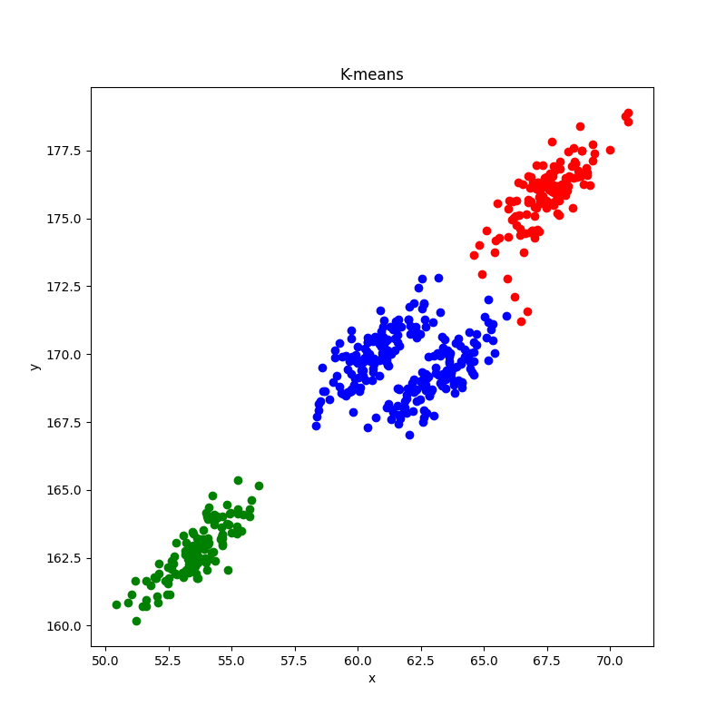
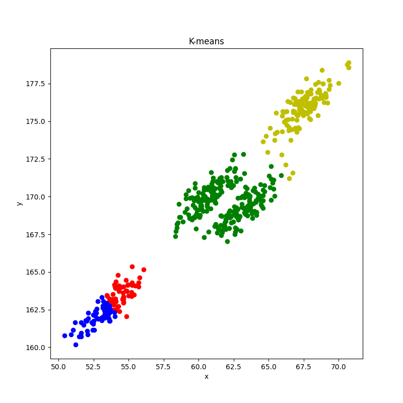

# 实验七：聚类

两种距离计算公式的实现

```py
#曼哈顿距离
def manhattan_distance(x, y):
    return abs(x - y).sum()

#欧式距离
def euclidean_distance(x,y):
    return math.sqrt(((x - y)**2).sum())
```

本次实验使用欧式距离

## 算法一：原型聚类法

### 代码

```py
import pandas as pd
import numpy as np
import matplotlib.pyplot as plt
import math
import matplotlib as mpl
import warnings
import random
warnings.filterwarnings('ignore')
from pandas.core.frame import DataFrame
from matplotlib.axes._axes import _log as matplotlib_axes_logger
matplotlib_axes_logger.setLevel('ERROR')

#欧式距离
def euclidean_distance(x,y):
    return math.sqrt(((x - y)**2).sum())

#加载数据集
df = pd.read_csv('train.csv')
D = np.array(df)

#聚类数量
k = 3

#初始化每个聚类的簇心向量
u = [None for i in range(k)]
u_prime = [None for i in range(k)]

#随机选取k个样本作为初始均值向量
for i in range(k):
    #随机选取一个样本的索引
    index = random.randint(0, len(D) - 1)
    #将该样本作为初始均值向量
    u_prime[i] = D[index]

#比较均值向量是否相同
def equallist(x,y):
    for i in range(len(x)):
        if not (x[i] == y[i]).all():
            return False
    return True

C = [[] for i in range(k)]

#迭代过程
while(not equallist(u, u_prime)):
    #初始化
    u = u_prime.copy()
    C = [[] for i in range(k)]

    #计算每个样本与k个聚类的簇心的距离，将其划入距离最近的簇
    for i in range(len(D)):
        d = [0 for _ in range(k)]
        for j in range(k):
            d[j] = euclidean_distance(D[i], u[j])
        C[d.index(min(d))].append(D[i])
    
    #更新这轮迭代的簇心
    for i in range(k):
        u_prime[i] = np.mean(C[i], axis=0)

# 判断是否有空簇,返回所有非空的簇,空簇丢弃
def check_null(C):
    C_new = []
    for i in range(len(C)):
        if len(C[i]) == 0:
            continue
        else:
            C_new.append(C[i])
    return C_new

C = check_null(C)

# 将数据集的二维特征值作为绘图的横纵坐标，将所有样本绘制到一张图中，其中同一聚类的样本点绘制为相同颜色
plt.figure(figsize=(10, 10))
plt.title('K-means')
plt.xlabel('x')
plt.ylabel('y')
color = ['r', 'g', 'b', 'y', 'c', 'm', 'k', 'w']
for i in range(len(C)):
    for j in range(len(C[i])):
        plt.scatter(C[i][j][0], C[i][j][1], c=color[i], marker='o')
plt.show()

```

### 结果

k = 3时



k = 4时



直觉上，k = 3的聚类效果比k = 4好。

## 算法二：密度聚类法

### 代码

### 结果
